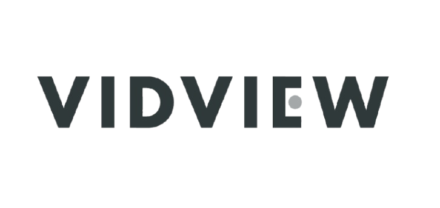
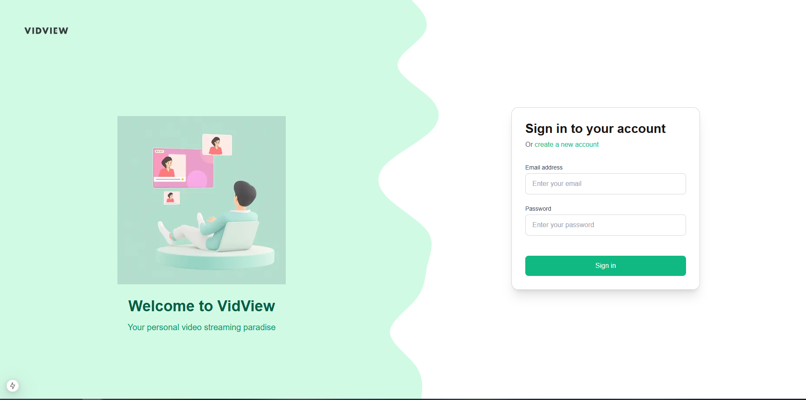
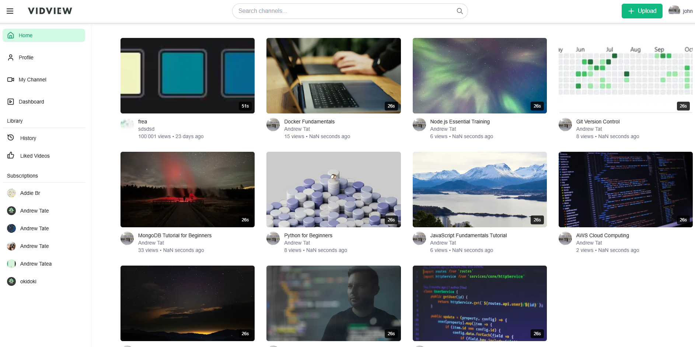
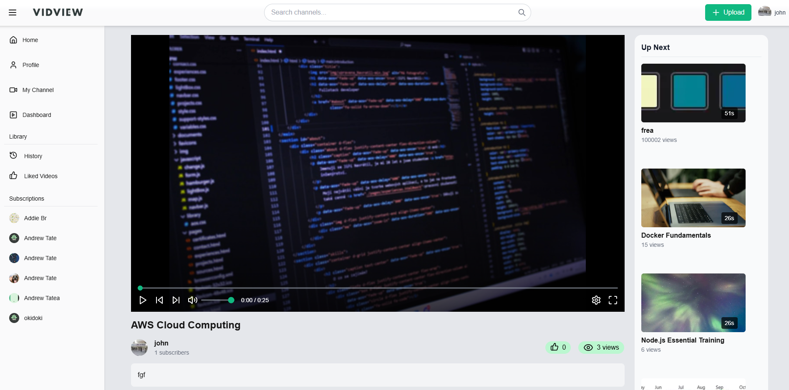

# VidView - Video Streaming Platform 🎥



VidView is a modern video streaming platform built with Next.js and Node.js, offering a seamless experience for content creators and viewers. Share, watch, and engage with videos in a user-friendly environment.

## ✨ Features

- 🎥 Video upload and streaming
- 👤 User authentication and profiles
- 💬 Real-time comments and interactions
- 👍 Like and subscription system
- 🎨 Responsive design with dark mode
- 🔍 Video search and filtering
- 📱 Mobile-friendly interface
- 🎯 Custom video player
- 📊 User dashboard
- 🖼️ Customizable user/channel pages

## 🛠️ Tech Stack

### Frontend
- **Next.js 14** - React framework
- **Tailwind CSS** - Styling
- **Zustand** - State management
- **Axios** - API requests
- **Lucide React** - Icons
- **React Hot Toast** - Notifications

### Backend
- **Node.js** - Runtime environment
- **Express.js** - Web framework
- **MongoDB** - Database
- **Mongoose** - ODM
- **JWT** - Authentication
- **Cloudinary** - Media storage
- **Bcrypt** - Password hashing

## 🚀 Getting Started

### Prerequisites
- Node.js (v18 or higher)
- MongoDB
- npm or yarn
- Git

### Installation

1. Clone the repository
```bash
git clone https://github.com/yourusername/vidview.git
cd vidview
```

2. Install dependencies for both frontend and backend
```bash
# Frontend dependencies
cd front-end/vid-tube
npm install

# Backend dependencies
cd ../../back-end
npm install
```

3. Set up environment variables

Frontend (.env.local):
```env
NEXT_PUBLIC_API_URL=http://localhost:7000
```

Backend (.env):
```env
PORT=7000
MONGODB_URI=your_mongodb_uri
JWT_SECRET=your_jwt_secret
CLOUDINARY_CLOUD_NAME=your_cloudinary_name
CLOUDINARY_API_KEY=your_cloudinary_key
CLOUDINARY_API_SECRET=your_cloudinary_secret
```

4. Run the development servers

Frontend:
```bash
cd front-end/vid-tube
npm run dev
```

Backend:
```bash
cd back-end
npm run dev
```

The application will be available at:
- Frontend: `http://localhost:3000`
- Backend: `http://localhost:7000`

## 📱 Screenshots

[Add screenshots of your application here]
### Login


### Home Page


### Video Player



## 🌐 Deployment

The application can be deployed using:
- Frontend: Vercel
- Backend: Render
- Database: MongoDB Atlas
- Media Storage: Cloudinary

## 🔑 Environment Variables

### Frontend Variables
| Variable | Description |
|----------|-------------|
| NEXT_PUBLIC_API_URL | Backend API URL |

### Backend Variables
| Variable | Description |
|----------|-------------|
| PORT | Server port |
| MONGODB_URI | MongoDB connection string |
| JWT_SECRET | JWT secret key |
| CLOUDINARY_CLOUD_NAME | Cloudinary cloud name |
| CLOUDINARY_API_KEY | Cloudinary API key |
| CLOUDINARY_API_SECRET | Cloudinary API secret |

## 🤝 Contributing

1. Fork the repository
2. Create your feature branch (`git checkout -b feature/AmazingFeature`)
3. Commit your changes (`git commit -m 'Add some AmazingFeature'`)
4. Push to the branch (`git push origin feature/AmazingFeature`)
5. Open a Pull Request

## 📄 License

This project is licensed under the MIT License - see the [LICENSE](LICENSE) file for details.

## 👏 Acknowledgments

- Next.js team for the amazing framework
- Tailwind CSS for the utility-first CSS framework
- MongoDB for the reliable database
- Cloudinary for media storage solutions

## 📧 Contact

Yossef Assouline 


